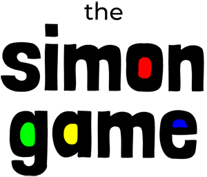
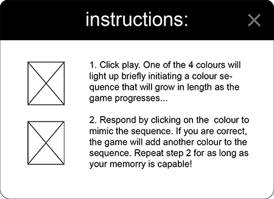
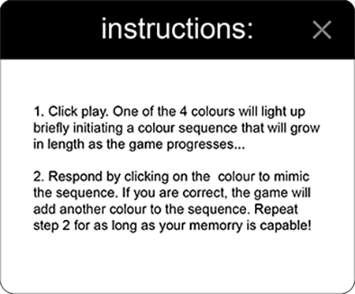

 

 
 

 

A classic memory game designed for all ages to enjoy. The Simon Game is simple:- a set of colours flash in a randomised sequence. The player must respond by repeating the sequence back, clicking on the colours in the order that they appeared. The game features 3 different levels and options to customize the game sounds and starting levels. View the Simon Game [here](https://github.com/fdeboo/simon)

# Table of contents
1. [UX](#introduction)
    * [Objective](#objective)
    * [User stories](#users)
    * [Wireframes](#wireframes)
    * [Design Notes](#design)
2. [Features](#features)
    * [Existing Features](#existing_feat)
    * [Features left to implment](#future_feat)
3. [Technologies Used](#technologies)
4. [Testing](#testing)
5. [Deployment](#deployment)
6. [Credits](#credits)
    * [Content](#content)
    * [Media](#media)
    * [Acknowledgements](#acknowledgements)

## UX 

#### Objective 
+ The focus of this project is to build an interactive game that users of all ages can engage with.
+ Users will likely be visting the site in their downtime. That being so, the game should provide a bright and positive experience and fulfill their need to be entertained.
+ The game, as a feature, is fundamental to the site and it should be prioritised in the design.

#### User Stories 
"As a user, I would like to ___________"
+ Read instructions on how to play the game
+ Be tested by a game that increases in complexity
+ Have some control and be able to customise elements of the game
+ Be able to play the game by tapping a screen or using a mouse
+ Restart the game at anytime
+ Keep track of my points total and be able to compare with my previous scores

#### Wireframes 
+ The game interface will be relative to the size of the view port. This means that whatever device the game is played on, there should be no overflowing content requiring the user to scroll. 

+ The game interface will be divided into the 4 game colours, each 50% of the viewport's width and height. 

Display on large screens:   
  

Display on mobile devices:   
  

+ The central circle is the focal point of the UI and will contain the game logo and the features that are vital to the game; the play button and a link to the instructions. Any other features will be accessible via a toggled navigation bar, keeping the UI minimal and uncluttered. 

Content in the central circle is limited to the most important information:   
  

+ Modals are used to display any further content and features, overlaying the game interface but crucially not navigating away from it.
+ Each modal should follow the same layout for consistency.

 Illustrations that support the text are displayed on larger screens but are removed on smaller devices  
        

#### Design 
+ The design is intended to be minimalistic but should provide enough information to be intuitive. 
+ The colours of Simon game fill the UI so that it feels vibrant and positive.
+ The game takes precedence over everything else. The navigation bar providing any extra links will be tucked away off screen and toggled down from the top using a imple burger icon.
+ Font Awesome icons are employed as visual cues to help make the UI as intuitive as possible. It is important that these are used in moderation so that they do not become distracting. 

##### Typography
+ The fonts chosen for this project are <b>"Londrina Solid"</b> and <b>"Montserrat."</b> from google fonts
+ Londrina Solid is used for the Game Title and headings. It exudes friendly character and stability due to a combination of it's rounded corners and solid weight.
+ The Modal headings also use Londrina Solid, but using a lighter weight for better legibility.
+ All headings and titles are written in lowercase to compliment the informality of the site.
+ Montserrat was chosen for all paragraph text and navigational links where legibility was most important. The font pairs well with Londrina Solid because it is neutral, has a clean rounded form and is light in weight.

## Features 
#### Existing Features 
+ Score system
    + Every time the user repeats back the complete sequence correctly, 5 points is added to their running score. The points total is updated on the UI so that the user is aware of their progress.
+ How To Play modal
    + The modal is accessed via a link, which is primely positioned just beneath the play button for visibility. It provides 2-step instructions for any users who are new to the game.  
+ Settings Model
    + This modal allows the user to choose alternative game sounds from a drop down menu. 
    + The settings are implemented straight away after clicking 'OK' 
    + The user may also choose the starting level for the game from this panel.
+ High Scores modal
    + Presents the top 5 scores attained by the user in a clean and simple table. 
    + If local storage returns no data for the user, the table is filled with '0'.
    + Opening or closing the modal does not interrupt the playback of the game.
+ Restart the Game
    + An option that reloads the page so that a user can restart the game with a new sequence
+ Feedback modal 
    + Enables the user to send feedback to the developer via emailjs 
    + Opening or closing the modal does not interrupt the playback of the game.
    + Submitting the feedback via the 'Send Feedback' button clears the inputted values and closes the modal but does not reload the page.
+ Gameover modal 
    + Launched as soon as the code evaluates the user input to be unequal to the Simon sequence.
    + Displays the score acheived for the active game session.
    + The page is reloaded whichever way the modal is closed by the user.
+ Level up
    + The duration of each colour flash is decreassed once the user reaches a target score. This triggers an animation on screen that lets the user that they have reached a new level. As a result, the speed of the game increases which makes the game more challenging.

#### Features Left to Implement 
+ The opportunity for a user to create a username against which their highscores can be saved
+ High scores are available for all global users of the game, making the game more competitive

## Technologies Used 
#### Frontend:
+ HTML, CSS, Javascript
    + Frontend programming languages
+ [JQuery](https://jquery.com/)
    + Simplifies access and manipluation of the DOM
+ [Bootstrap](https://getbootstrap.com/)
    + Provides the visual formatting of the website and it's responsiveness accross all devices
+ [Howler.js](https://howlerjs.com/)
    + Handles the playback of the audio files accross all devices
+ [Email.js](https://www.emailjs.com/)
    + Enables comments provided in the feedback form to be sent to me, the developer via email.
+ [Google Fonts](https://fonts.google.com/)
    + Provides access to the web fonts used in this project
+ [Font Awesome](https://fontawesome.com/)
    + Provides the icons used in this project to guide the users' navigation.

#### Other:
+ [Visual Studio Code](https://code.visualstudio.com/)
    + The IDE that facilitated the devlopment of this project.
+ [GitHub](https://github.com/)
    + The platform where the project code is stored remotely
+ Adobe Illustrator
    + Facilitated the creation of images used in this project 

## Testing 
#### Validators

The following services were used to check the web code:

+ HTML
    + [W3C Markup Validation](https://validator.w3.org/)
+ CSS
    + [CSS Lint](http://csslint.net/)
+ Javascript
    + [Javascript Lint](https://jshint.com/)

#### Manual
    These were the manual tests performed and passed:

Attempted to click while the sequence was playing.
Tried to change the sounds halfway through the game.
Restarted the game while playing.
Closed browser and reopened to find last selected sounds.

#### Know bugs
At faster speed levels, consecutive flashes of the same colour blend into one.
This will be addressed in a later release of the app.

## Deployment 
#### Remote
The following steps were taken to deploy the project to GitHub Pages where the Simon Game is hosted:

1. From within Github, navigate to fdeboo/simon
2. Select the Settings tab from the menu, found beneath the repository name 
3. Scroll down to the GitHib Pages section.
4. Under 'Source', choose 'Master Branch' from the dropdown menu
5. The page will automatically refresh and the site is deployed
6. A link to the live site is provided

#### Local
1. To run this project locally, navigate to the repository on github [here](https://github.com/fdeboo/simon)
2. Click on the green "Clone or Download" button
3. Copy the URL from the dropdown
4. In your local IDE, open the terminal ensure the current working directory is set to where you want the clone to be created
5. Type <code>git clone</code> and then paste the copied link: <pre><code>git clone https://github.com/fdeboo/simon</code></pre>
6. Press enter. This completes the deployment.

## Credits 

#### Content 
All paragraph text and content was written by me.

#### Media  
##### Images
+ The illustrations used in the How To Play modal were created by me using Adobe Illustrator
##### Audio
+ The audio files for the default Simon Beeps were sourced from [FreeCodeCamp](https://www.freecodecamp.org/) 
+ The audio files for both the Farm Animal and Flatulence sounds were sourced from [Zapsplat](https://www.zapsplat.com/) 
+ The Harpsichord and Silence sounds were recorded and provided by [GBrachetta](https://github.com/GBrachetta) 

#### Code  
+ My understanding of the Set Interval Function, which was pivotal to the game's success, was explained to me at [Medium.com](https://medium.com/@eric.stermer/setinterval-simply-put-is-a-timed-loop-652eb54bd5f8) 
+ The highscores retrieved from the local storage are presented as a string of numbers. The code used to convert this string into an array of numbers was sourced from this [Stack Overflow](https://stackoverflow.com/questions/15677869/how-to-convert-a-string-of-numbers-to-an-array-of-numbers) post.
+ The code used to reload the page no matter how the 'game over' modal is closed, was sourced from this [Stack Overflow](https://stackoverflow.com/questions/21578315/how-to-reload-page-on-closing-a-bootstrap-3-modal) post.
+ [W3Schools](w3schools.com) was a reliable resource throughout my project for it's comprehensive explanation of JavaScript data types and methods. Specifically, the code used to present users with their top 5 highscores owes thanks to W3Schools' teaching on how to add items to an array in place of other values, and how to numerically sort an array in ascending order.

#### Acknowledgements 
Special thanks to, 
+ Mentor Aaron Sinott, for the sessions that ran into overtime and for all his words of encouragement.
+ [GBrachetta](https://github.com/GBrachetta) for his invaluable advice, conversation and compassion that made the most challenging parts of the project more tolerable. 